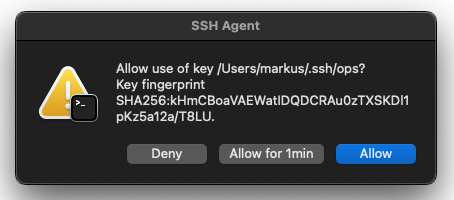

# ssh-askpass



SSH key forwarding is dangerous and a [large attack vector](https://defn.io/2019/04/12/ssh-forwarding/).

Here’s what man [ssh_config(5)](https://man-api.ch/v1/buster/5/ssh_config) has to say about ForwardAgent:

> Agent forwarding should be enabled with caution.
> Users with the ability to bypass file permissions
> on the remote host can access the local agent
> through the forwarded connection.
>
> An attacker cannot obtain key material from the agent,
> however they can perform operations on the keys
> that enable them to authenticate using the identities
> loaded into the agent.

The solution is to confirm by hand each time the key is used.
For this we use a simple Allow/Deny dialog which can be confirmed with the return key.
So no big loss of comfort.

* With this setup `ssh-agent` will ask for confirmation every time an ssh key is used
* This solution refers to macOS, since macOS does not include `ssh_askpasss` by default
* For this to work SSH keys must be loaded with [`ssh-add -c`](https://man-api.ch/v1/buster/1/ssh-add)

## Setup

1. Download the script and make it executable
2. Set `SSH_ASKPASS` to the path of the script
3. Load the SSH key with `ssh-add -c /path/to/key`

```shell
$ cat .zshrc | grep askpass -A8
# askpass
export DISPLAY=":0"
export SSH_ASKPASS="$HOME/bin/ssh-askpass"
export SSH_AUTH_SOCK="$HOME/.ssh/ssh-agent.sock"

if ! ssh-add -l 2>/dev/null >/dev/null; then
  killall ssh-agent
  rm $SSH_AUTH_SOCK
  ssh-agent -a "$SSH_AUTH_SOCK" >/dev/null
fi
```

## Inspiration

* https://serverfault.com/a/238500